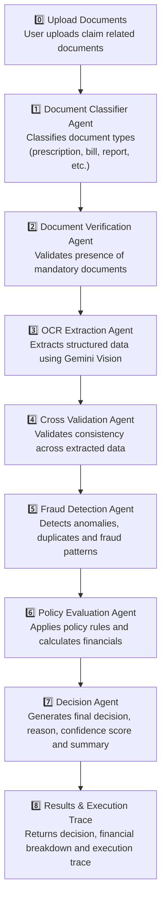

# 🏥 Intelligent Health Insurance Claims Processing System

An AI-powered, multi-agent Health Insurance Claims Processing platform built for the **Plum AI Engineer Assignment**.

The system combines **LLM-powered document understanding** with a **deterministic rule engine** to automatically classify, validate, extract, verify, adjudicate, and explain health insurance claims.

---

# Live Demo

**Frontend (Vercel)**

```
[https://<your-vercel-url>](https://health-insurance-claims-system.vercel.app/)
```

**Backend (Azure Container Apps)**

```
https://plum-claims-api.salmonwater-ff420537.centralindia.azurecontainerapps.io
```

**API Documentation**

```
[https://<your-azure-containerapp-url>/docs](https://plum-claims-api.salmonwater-ff420537.centralindia.azurecontainerapps.io/docs)
```

**GitHub Repository**

```
[https://github.com/<your-repository>](https://github.com/AnkithBinagekar/health-insurance-claims-system)
```

---

# Overview

The application processes medical insurance claims by combining AI-powered document understanding with deterministic business rules.

The backend follows a **Multi-Agent Architecture**, where each agent performs one specialized responsibility.

Rather than relying entirely on an LLM, the system separates:

* AI Tasks
* Business Logic
* Policy Rules
* Fraud Checks
* Financial Calculations

This produces decisions that are:

* Explainable
* Traceable
* Deterministic
* Auditable

---

# Key Features

* Multi-Agent AI pipeline
* Explainable decision making
* Deterministic policy evaluation
* Medical document classification
* OCR-based information extraction
* Identity verification
* Fraud detection
* Financial adjudication
* Confidence scoring
* Graceful degradation
* Automatic Gemini API retry mechanism
* Local response caching
* Interactive execution trace
* Bounding-box visualization
* Azure Container Apps deployment
* Dockerized backend
* Responsive React frontend

---

# System Architecture

```mermaid
flowchart TB

%% =====================
%% USER LAYER
%% =====================

subgraph USER["User Layer"]
    U[👤 User]
end

%% =====================
%% FRONTEND
%% =====================

subgraph FE["Frontend (Vercel)"]
    UI["React + TypeScript<br/>Claim Submission UI<br/>Results Dashboard"]
end

%% =====================
%% BACKEND
%% =====================

subgraph BE["Backend (Azure Container Apps)"]

    API["FastAPI Backend<br/>Claim Orchestrator (API)"]

    subgraph AGENTS["AI Agent Pipeline"]

        A1["1. Document Classifier Agent"]
        A2["2. Document Verification Agent"]
        A3["3. OCR Extraction Agent"]
        A4["4. Cross Validation Agent"]
        A5["5. Fraud Detection Agent"]
        A6["6. Policy Evaluation Agent"]
        A7["7. Decision Agent"]

        A1 --> A2
        A2 --> A3
        A3 --> A4
        A4 --> A5
        A5 --> A6
        A6 --> A7

    end

    API --> A1

end

%% =====================
%% DATA STORAGE
%% =====================

subgraph DATA["Data & Storage"]

    D1["Uploaded Documents<br/>(Azure Storage)"]

    D2["Policy Rules (JSON)<br/>policy_terms.json"]

    D3["Execution Trace<br/>(Per Claim)"]

    D4["Claim Store<br/>(SQLite)"]

end

%% =====================
%% GEMINI
%% =====================

subgraph AI["External AI Service"]

    G["Gemini Vision API<br/>Document Understanding & OCR"]

end

%% =====================
%% OBSERVABILITY
%% =====================

subgraph OBS["Resilience & Observability"]

    O1["Retry<br/>(Exponential Backoff)"]

    O2["MD5 Response Cache"]

    O3["Graceful Degradation"]

    O4["Confidence Ledger"]

    O5["Explainable Execution Trace"]

end

%% =====================
%% CONNECTIONS
%% =====================

U --> UI
UI --> API

A7 --> DATA
DATA --> G
G --> OBS
```


# Agent Execution Pipeline


---

# Multi-Agent Workflow

## 1. DocumentClassifierAgent

Responsibilities

* Detect document type
* Classify uploaded files
* Estimate confidence
* Prepare documents for downstream processing

---

## 2. DocumentVerificationAgent

Responsibilities

* Verify required documents
* Validate claim completeness
* Stop pipeline when mandatory documents are missing
* Handle graceful degradation when AI services are unavailable

---

## 3. OCRExtractionAgent

Responsibilities

* Extract patient details
* Extract hospital information
* Extract invoice items
* Extract financial values
* Extract treatment information

---

## 4. CrossValidationAgent

Responsibilities

* Match patient identity
* Validate member ID
* Detect inconsistencies across uploaded documents

---

## 5. FraudDetectionAgent

Responsibilities

* Detect suspicious claims
* Flag duplicate submissions
* Detect policy violations
* Generate fraud indicators

---

## 6. PolicyEvaluationAgent

Responsibilities

* Apply insurance policy rules
* Calculate eligible coverage
* Determine exclusions
* Evaluate waiting periods
* Compute payable amount

---

## 7. DecisionAgent

Responsibilities

* Produce final claim decision
* Calculate approved amount
* Generate confidence score
* Produce explainable execution trace

---

# Technology Stack

## Backend

* Python 3.10
* FastAPI
* Pydantic v2
* Google Gemini API
* Tenacity
* Uvicorn

---

## Frontend

* React
* TypeScript
* Vite
* TailwindCSS
* shadcn/ui
* Axios

---

## AI

* Gemini Vision
* Gemini Flash
* Prompt Engineering
* Multi-Agent Architecture

---

## Deployment

* Docker
* Azure Container Apps
* Azure Container Registry
* Vercel

---

# Folder Structure

```
health-insurance-claims-system/

├── backend/
│   ├── app/
│   │   ├── agents/
│   │   ├── api/
│   │   ├── core/
│   │   ├── models/
│   │   ├── schemas/
│   │   ├── services/
│   │   └── utils/
│   └── main.py
│
├── frontend/
│   ├── src/
│   │   ├── components/
│   │   ├── pages/
│   │   ├── services/
│   │   └── hooks/
│
├── tests/
│
├── policy_terms.json
├── eval_report.json
├── Dockerfile
├── requirements.txt
└── README.md
```

---

# Local Setup

## Backend

```bash
git clone <repository>

cd health-insurance-claims-system

python -m venv venv

source venv/bin/activate
# Windows:
venv\Scripts\activate

pip install -r requirements.txt

uvicorn backend.app.main:app --reload
```

Backend runs on

```
http://localhost:8000
```

Swagger

```
http://localhost:8000/docs
```

---

## Frontend

```bash
cd frontend

npm install

npm run dev
```

Frontend

```
http://localhost:5173
```

---

# Environment Variables

Backend

```
GEMINI_API_KEY=<your_api_key>

ENVIRONMENT=development
```

Frontend

```
VITE_API_BASE_URL=http://localhost:8000
```

Production

```
VITE_API_BASE_URL=https://<azure-containerapp-url>
```

---

# Deployment

## Backend

* Docker
* Azure Container Registry
* Azure Container Apps

## Frontend

* Vercel

---

# Evaluation Results

The project was validated using the provided evaluation suite.

Results:

* Functional test cases passed
* Document validation
* OCR extraction
* Policy evaluation
* Fraud detection
* Decision explanation
* Graceful degradation
* End-to-end workflow

---

# Graceful Degradation

The system is designed to continue operating even when AI services experience temporary failures.

Implemented mechanisms include:

* Automatic retry with exponential backoff
* Confidence reduction
* Pipeline continuation
* Warning generation
* Explainable degradation traces

This prevents transient LLM failures from crashing the entire application.

---

# Assumptions

* Single insurance provider
* Policy rules stored in JSON
* Gemini Vision available for OCR and document understanding
* Uploaded documents are images or PDFs
* Claims processed independently
* Local cache used for repeated AI requests

---

# Engineering Trade-offs

Current implementation prioritizes clarity and assignment requirements over production-scale infrastructure.

Current trade-offs include:

* Local file cache instead of Redis
* JSON policy store instead of database
* Stateless API
* No authentication
* No persistent claim database
* Single-region deployment

These decisions reduce complexity while maintaining a clean architecture.

---

# Future Improvements

* PostgreSQL for persistent storage
* Redis distributed cache
* Azure Blob Storage
* Azure Service Bus
* Kubernetes deployment
* ML-based fraud scoring
* OCR fallback using Tesseract
* User authentication
* Real-time claim tracking
* Horizontal autoscaling

---

# Screenshots

Include screenshots of:

* Claim submission
* AI execution trace
* Financial breakdown
* Document verification
* Swagger documentation

---

# License

This repository was developed as part of the **Plum AI Engineer Assignment** and is intended for educational and evaluation purposes.
